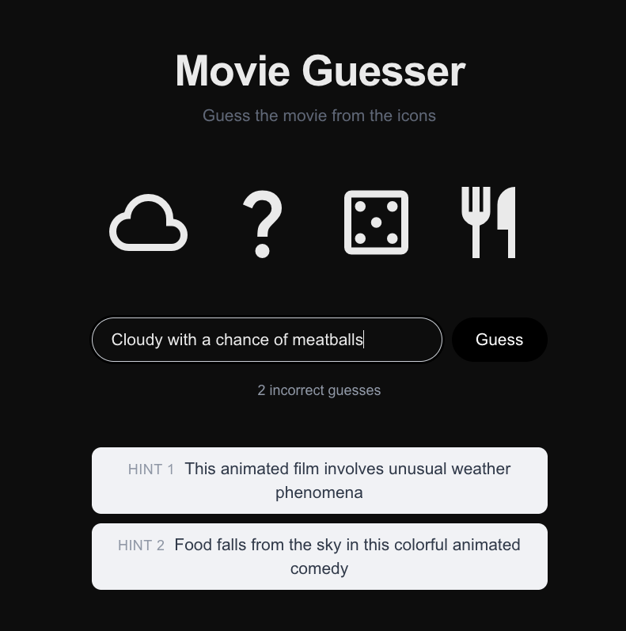
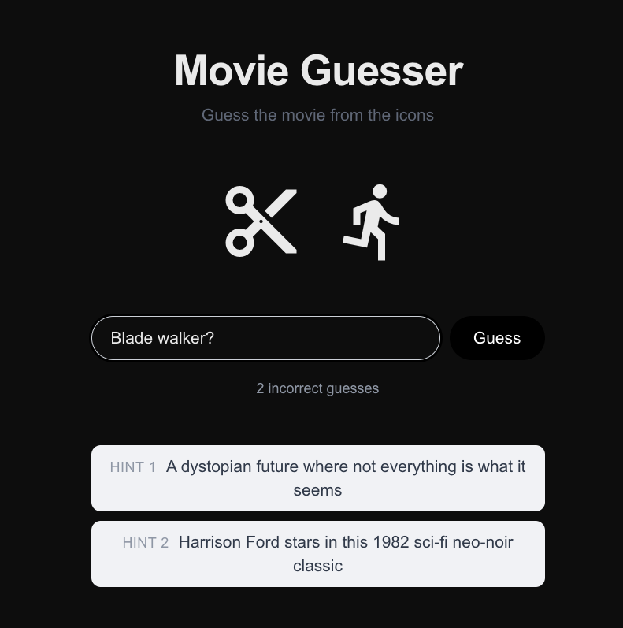

# Movie Guesser

 

**[Live demo →](https://movie-guesser-two.vercel.app)**

A small web game that demonstrates two practical LLM integration patterns: constrained generation and fuzzy evaluation. Guess the movie from a row of Google Material Symbols icons.

## How it works

**Generating a puzzle** — the server asks Claude (Sonnet) to pick a movie and encode its title as 1–5 Material Symbols icons. Every icon name is validated against the full 4,200-name icon list before being shown; invalid names trigger a retry, and any still-invalid names fall back to a generic icon. The movie title never leaves the server.

**Judging a guess** — a local normalised string check runs first (free, instant). On a miss, Claude (Haiku) judges whether the guess is close enough, tolerating typos, missing articles, and alternate titles. Wrong guesses progressively reveal up to five hints, the last two of which are algorithmically generated from the title.

**State** — puzzle answers are stored in Upstash Redis with a 24-hour TTL, keyed by a random `puzzleId`. The browser only ever sees icons and a puzzle ID.

## Stack

- [Next.js 16](https://nextjs.org) — App Router, TypeScript
- [Anthropic SDK](https://github.com/anthropics/anthropic-sdk-typescript) — Claude Sonnet (generation) and Claude Haiku (judging)
- [Upstash Redis](https://upstash.com) — serverless puzzle state storage
- [Google Material Symbols](https://fonts.google.com/icons) — icon set
- [Tailwind CSS v4](https://tailwindcss.com)

## Running locally

1. Clone the repo and install dependencies:

```bash
npm install
```

2. Copy the env example and fill in your keys:

```bash
cp .env.local.example .env.local
```

You need:
- `ANTHROPIC_API_KEY` — from [console.anthropic.com](https://console.anthropic.com)
- `UPSTASH_REDIS_REST_URL` and `UPSTASH_REDIS_REST_TOKEN` — from [upstash.com](https://upstash.com) (free tier is enough)

3. Start the dev server:

```bash
npm run dev
```

Open [http://localhost:3000](http://localhost:3000).

## Deploying

Deploy to [Vercel](https://vercel.com) and add the three environment variables in the project settings. Upstash Redis can be provisioned directly from the Vercel Marketplace.

## Rate limits

- `/api/generate` — 20 requests per IP per hour
- `/api/guess` — 60 requests per IP per hour

---

Built by orchestrating [Claude Code](https://claude.ai/code).
